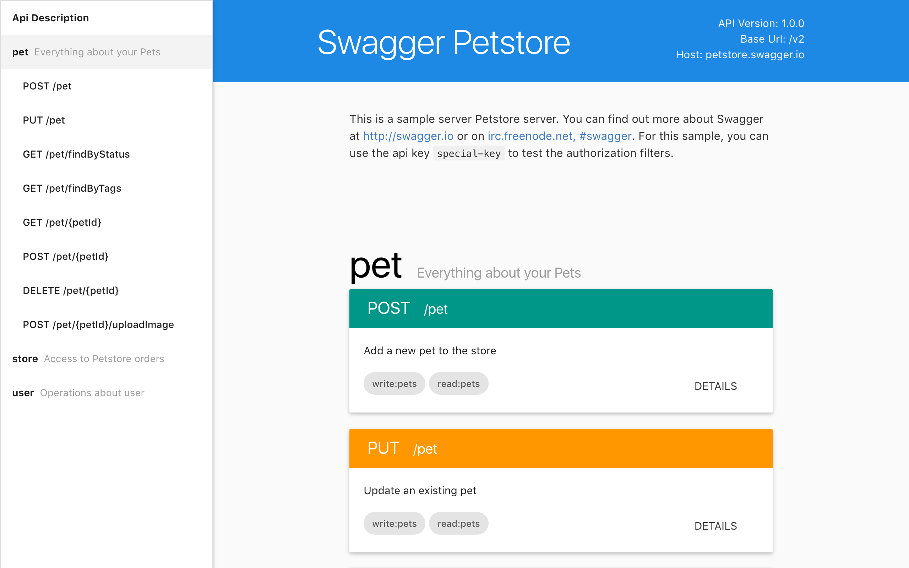

# Material Swagger UI

> This repo is still in very pre-alpha stage

## Usage

Parameter `url` in url query will be used as definition url, or `http://petstore.swagger.io/v2/swagger.json` will be used by default.

## LICENSE

Licensed under the Apache License, Version 2.0 (the "License"); you may not use this file except in compliance with the License.
You may obtain a copy of the License at [apache.org/licenses/LICENSE-2.0](apache.org/licenses/LICENSE-2.0)

Unless required by applicable law or agreed to in writing, software distributed under the License is distributed on an "AS IS" BASIS, WITHOUT WARRANTIES OR CONDITIONS OF ANY KIND, either express or implied. See the License for the specific language governing permissions and limitations under the License.
